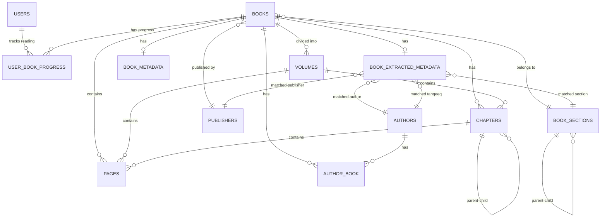

# Database Schema Analysis - BMS_alkamelah

## Database Info
- **Database**: `bms_v2`
- **Connection**: MySQL
- **Host**: `145.223.98.97:3306`

---

## Entity Relationship Diagram

---

## Tables Overview

| # | Table | Purpose | Model |
|---|-------|---------|-------|
| 1 | `books` | Core book records | `Book` |
| 2 | `authors` | Author information | `Author` |
| 3 | `author_book` | Book-Author pivot (M:N) | `AuthorBook` |
| 4 | `pages` | Book page content | `Page` |
| 5 | `chapters` | Book chapters (hierarchical) | `Chapter` |
| 6 | `volumes` | Book volumes/parts | `Volume` |
| 7 | `book_sections` | Categories (hierarchical) | `BookSection` |
| 8 | `publishers` | Publisher information | `Publisher` |
| 9 | `book_metadata` | Additional book info | `BookMetadata` |
| 10 | `book_extracted_metadata` | AI-extracted metadata | `BookExtractedMetadata` |
| 11 | `user_book_progress` | User reading progress | `UserBookProgress` |
| 12 | `users` | User accounts | `User` |

---

## Table Structures

### 1. `books`
Main book table storing core book information.

| Column | Type | Description |
|--------|------|-------------|
| `id` | bigint | Primary key |
| `shamela_id` | int? | Shamela library ID (imported books) |
| `title` | string | Book title |
| `description` | text? | Book description |
| `visibility` | enum | `public`, `private`, `restricted` |
| `book_section_id` | FK? | Category reference |
| `publisher_id` | FK? | Publisher reference |
| `has_original_pagination` | bool | Has original page numbers |
| `additional_notes` | text? | Extra notes |
| `created_at` | timestamp | Created date |
| `updated_at` | timestamp | Updated date |

**Relationships:**
- `belongsTo` → BookSection, Publisher
- `belongsToMany` → Authors (via author_book)
- `hasMany` → Volumes, Chapters, Pages
- `hasOne` → BookMetadata, BookExtractedMetadata

---

### 2. `authors`
Stores author/scholar information with Islamic naming conventions.

| Column | Type | Description |
|--------|------|-------------|
| `id` | bigint | Primary key |
| `first_name` | string? | First name |
| `middle_name` | string? | Middle name |
| `last_name` | string? | Last name |
| `laqab` | string? | لقب (Title/Nickname) |
| `kunyah` | string? | كنية (Abu-style name) |
| `biography` | text? | Biography |
| `video_links` | json? | Related video links |
| `image` | string? | Author image path |
| `madhhab` | enum? | المذهب الفقهي (Fiqh school) |
| `is_living` | bool | Is alive? |
| `birth_date` | date? | Birth date |
| `death_date` | date? | Death date |

**Madhhab Options:** حنفي، مالكي، شافعي، حنبلي، آخرون

---

### 3. `author_book` (Pivot)
Many-to-many relationship between books and authors with role information.

| Column | Type | Description |
|--------|------|-------------|
| `id` | bigint | Primary key |
| `book_id` | FK | Book reference |
| `author_id` | FK | Author reference |
| `role` | enum | Role type (see below) |
| `is_main` | bool | Is main author? |
| `display_order` | int | Display order |
| `created_at` | timestamp | Created date |
| `updated_at` | timestamp | Updated date |

**Role Options:**
- `author` - مؤلف
- `co_author` - مؤلف مشارك
- `editor` - محقق
- `translator` - مترجم
- `reviewer` - مراجع
- `commentator` - معلق

---

### 4. `pages`
Stores actual page content of books.

| Column | Type | Description |
|--------|------|-------------|
| `id` | bigint | Primary key |
| `book_id` | FK | Book reference |
| `volume_id` | FK? | Volume reference |
| `chapter_id` | FK? | Chapter reference |
| `page_number` | int | Sequential page number |
| `internal_index` | int? | Internal index |
| `part` | string? | Part identifier |
| `content` | longtext? | Plain text content |
| `html_content` | longtext? | HTML formatted content |
| `original_page_number` | int? | Original book page number |

---

### 5. `chapters`
Hierarchical chapter structure (supports nesting).

| Column | Type | Description |
|--------|------|-------------|
| `id` | bigint | Primary key |
| `book_id` | FK | Book reference |
| `volume_id` | FK? | Volume reference |
| `title` | string | Chapter title |
| `parent_id` | FK? | Parent chapter (self-ref) |
| `level` | int | Nesting level (0 = root) |
| `order` | int | Display order |
| `page_start` | int? | Starting page |
| `page_end` | int? | Ending page |

---

### 6. `volumes`
Book volumes/parts (multi-volume books).

| Column | Type | Description |
|--------|------|-------------|
| `id` | bigint | Primary key |
| `book_id` | FK | Book reference |
| `number` | int | Volume number |
| `title` | string? | Volume title |
| `page_start` | int? | Starting page |
| `page_end` | int? | Ending page |

---

### 7. `book_sections`
Hierarchical book categories.

| Column | Type | Description |
|--------|------|-------------|
| `id` | bigint | Primary key |
| `name` | string | Section name |
| `description` | text? | Description |
| `parent_id` | FK? | Parent section (self-ref) |
| `sort_order` | int | Display order |
| `is_active` | bool | Is visible? |
| `logo_path` | string? | Section logo |

---

### 8. `publishers`
Publisher information.

| Column | Type | Description |
|--------|------|-------------|
| `id` | bigint | Primary key |
| `name` | string | Publisher name |
| `address` | text? | Address |
| `country` | string? | Country |
| `email` | string? | Email |
| `phone` | string? | Phone |
| `description` | text? | Description |
| `website_url` | string? | Website |
| `image` | string? | Logo path |
| `is_active` | bool | Is active? |

---

### 9. `book_metadata`
Additional book metadata (images, videos, downloads).

| Column | Type | Description |
|--------|------|-------------|
| `id` | bigint | Primary key |
| `book_id` | FK | Book reference |
| `images` | json? | Book images array |
| `video_links` | json? | Video links array |
| `edition` | string? | Edition name |
| `edition_year` | string? | Edition year |
| `download_links` | json? | Download links array |
| `metadata` | json? | Other flexible metadata |

---

### 10. `book_extracted_metadata`
AI/automated extracted metadata with matching.

| Column | Type | Description |
|--------|------|-------------|
| `id` | bigint | Primary key |
| `book_id` | FK | Book reference |
| `extracted_section_name` | string? | Extracted category |
| `matched_section_id` | FK? | Matched BookSection |
| `section_match_confidence` | decimal? | Match confidence (0-1) |
| `extracted_author_name` | string? | Extracted author name |
| `extracted_author_death_year` | string? | Death year |
| `extracted_author_madhhab` | string? | Madhhab |
| `matched_author_id` | FK? | Matched Author |
| `author_match_confidence` | decimal? | Match confidence |
| `extracted_publisher_name` | string? | Publisher name |
| `extracted_publisher_city` | string? | Publisher city |
| `matched_publisher_id` | FK? | Matched Publisher |
| `publisher_match_confidence` | decimal? | Match confidence |
| `extracted_edition` | string? | Edition |
| `extracted_edition_number` | string? | Edition number |
| `extracted_year_hijri` | string? | Hijri year |
| `extracted_year_miladi` | string? | Gregorian year |
| `extracted_tahqeeq_name` | string? | Tahqeeq author name |
| `matched_tahqeeq_author_id` | FK? | Matched tahqeeq Author |
| `extracted_pages_count` | int? | Pages count |
| `extracted_volumes_count` | int? | Volumes count |
| `is_processed` | bool | Processing complete? |
| `is_applied` | bool | Applied to Book? |
| `needs_review` | bool | Needs manual review? |
| `processing_status` | enum | pending/extracted/matched/applied/failed |
| `error_message` | text? | Error message |
| `extracted_at` | datetime? | Extraction time |
| `applied_at` | datetime? | Application time |

---

### 11. `user_book_progress`
Track user reading progress.

| Column | Type | Description |
|--------|------|-------------|
| `id` | bigint | Primary key |
| `user_id` | FK | User reference |
| `book_id` | FK | Book reference |
| `last_page` | int | Last viewed page |
| `furthest_page` | int | Furthest page reached |
| `total_visits` | int | Total visits count |
| `total_reading_time` | int | Reading time (seconds) |
| `last_read_at` | datetime | Last reading time |

---

## Key Relationships Summary

### Hierarchical (Self-Referencing)
- `chapters.parent_id` → `chapters.id` (nested chapters)
- `book_sections.parent_id` → `book_sections.id` (nested categories)

### Many-to-Many
- `books` ↔ `authors` via `author_book` (with role, is_main, display_order)

### One-to-Many
- `books` → `pages`, `chapters`, `volumes`
- `volumes` → `chapters`, `pages`
- `chapters` → `pages`
- `publishers` → `books`
- `book_sections` → `books`
- `authors` → `book_extracted_metadata` (as matched_author, matched_tahqeeq)

### One-to-One
- `books` → `book_metadata`
- `books` → `book_extracted_metadata`

---

## Notes

> [!NOTE]
> **Missing from new project (vs BMS_v1):**
> - `books.status` field (published/draft)
> - `books.source_url` field
> - These may need to be added for the book reader migration

> [!TIP]
> **Strengths of this schema:**
> - Flexible author roles (author, editor, translator, etc.)
> - Hierarchical chapters and categories
> - AI metadata extraction with confidence scores
> - Reading progress tracking
