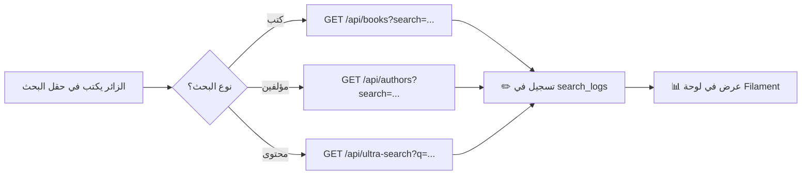

# 🔍 دليل تنفيذ نظام تسجيل البحث (Search Logging System)

> **الهدف:** تسجيل كل عملية بحث يقوم بها الزائر مع ربطها بسجل الزيارات (`page_visits`) لمعرفة الـ IP والمعلومات الأخرى.

---

## 📋 ملخص المشروع

### أنواع البحث الثلاثة في الموقع

| # | نوع البحث | الصفحة المصدر | الـ Endpoint | كيف يعمل |
|---|-----------|---------------|-------------|----------|
| 1 | **بحث في الكتب** | `static-search.blade.php` | `GET /api/books?search=كلمة` | يبحث في `books.title` عبر MySQL `LIKE` |
| 2 | **بحث في المؤلفين** | `static-search.blade.php` | `GET /api/authors?search=كلمة` | يبحث في `authors.first_name/last_name/laqab/kunyah` عبر MySQL |
| 3 | **بحث في المحتوى** | `ultra-fast.blade.php` + `advanced-search.blade.php` | `GET /api/ultra-search?q=كلمة` | يبحث في صفحات الكتب عبر **Elasticsearch** |

### مسار عمل البحث (Search Flow)



### الملفات المتأثرة

```
📁 المشروع
├── 📂 database/migrations/
│   └── 🆕 2026_02_12_000000_create_search_logs_table.php
├── 📂 app/Models/
│   └── 🆕 SearchLog.php
├── 📂 routes/
│   └── ✏️ web.php (تعديل 3 routes)
├── 📂 app/Filament/Resources/
│   └── 🆕 SearchLogResource.php
│   └── 📂 SearchLogResource/Pages/
│       └── 🆕 ListSearchLogs.php
└── 📂 app/Filament/Widgets/
    └── 🆕 SearchStatsWidget.php
```

---

## 🔷 المرحلة الأولى: قاعدة البيانات والنموذج (Migration + Model)

### الخطوة 1.1: إنشاء ملف الـ Migration

**الملف:** `database/migrations/2026_02_12_000000_create_search_logs_table.php`

**الأمر:**

```bash
php artisan make:migration create_search_logs_table
```

**محتوى الملف كاملاً:**

```php
<?php

use Illuminate\Database\Migrations\Migration;
use Illuminate\Database\Schema\Blueprint;
use Illuminate\Support\Facades\Schema;

return new class extends Migration
{
    public function up(): void
    {
        Schema::create('search_logs', function (Blueprint $table) {
            $table->id();

            // ====== بيانات البحث ======
            $table->string('query');                       // نص البحث الذي أدخله المستخدم
            $table->enum('search_type', [                  // نوع البحث
                'books',      // بحث في عناوين الكتب
                'authors',    // بحث في أسماء المؤلفين
                'content',    // بحث في محتوى صفحات الكتب (Elasticsearch)
            ]);
            $table->string('search_mode')->nullable();     // طريقة البحث (للمحتوى فقط)
                                                           // exact_match, flexible_match, morphological
            $table->string('word_order')->nullable();       // ترتيب الكلمات: consecutive, same_paragraph, any_order
            $table->string('word_match')->nullable();       // شرط الكلمات: all_words, some_words

            // ====== نتائج البحث ======
            $table->unsignedInteger('results_count')       // عدد النتائج المُرجعة
                  ->default(0);

            // ====== ربط بسجل الزيارات ======
            $table->unsignedBigInteger('page_visit_id')    // FK → page_visits.id
                  ->nullable();                            // nullable لأن الـ API لا يمر عبر Middleware
            $table->string('ip_address', 45)               // IP مباشرة من الطلب
                  ->nullable();

            // ====== فلاتر البحث المُطبَّقة ======
            $table->json('filters')->nullable();           // فلاتر مثل: {"book_id": [1,2], "author_id": [5]}

            $table->timestamps();

            // ====== الفهارس ======
            $table->foreign('page_visit_id')
                  ->references('id')
                  ->on('page_visits')
                  ->nullOnDelete();                        // إذا حُذفت الزيارة، نحتفظ بسجل البحث

            $table->index('search_type');                  // فلترة حسب النوع
            $table->index('created_at');                   // فلترة حسب التاريخ
            $table->index('ip_address');                   // فلترة حسب IP
            $table->index('query');                        // بحث في نصوص البحث
        });
    }

    public function down(): void
    {
        Schema::dropIfExists('search_logs');
    }
};
```

**تشغيل الـ Migration:**

```bash
php artisan migrate
```

---

### الخطوة 1.2: إنشاء الـ Model

**الملف:** `app/Models/SearchLog.php`

**الأمر:**

```bash
php artisan make:model SearchLog
```

**محتوى الملف كاملاً:**

```php
<?php

namespace App\Models;

use Illuminate\Database\Eloquent\Model;

class SearchLog extends Model
{
    protected $fillable = [
        'query',
        'search_type',
        'search_mode',
        'word_order',
        'word_match',
        'results_count',
        'page_visit_id',
        'ip_address',
        'filters',
    ];

    protected $casts = [
        'filters' => 'array',
        'results_count' => 'integer',
    ];

    // ==================== العلاقات ====================

    /**
     * ربط بسجل الزيارة (للوصول لمعلومات الـ IP والجهاز)
     */
    public function pageVisit()
    {
        return $this->belongsTo(PageVisit::class);
    }

    // ==================== Scopes ====================

    /**
     * فلترة حسب نوع البحث
     * @param string $type - books, authors, content
     */
    public function scopeOfType($query, string $type)
    {
        return $query->where('search_type', $type);
    }

    /**
     * فلترة بحث اليوم
     */
    public function scopeToday($query)
    {
        return $query->whereDate('created_at', today());
    }

    /**
     * فلترة بحث هذا الشهر
     */
    public function scopeThisMonth($query)
    {
        return $query->whereMonth('created_at', now()->month)
                     ->whereYear('created_at', now()->year);
    }

    // ==================== إحصائيات ====================

    /**
     * إجمالي عمليات البحث
     */
    public static function totalSearches(): int
    {
        return static::count();
    }

    /**
     * عمليات بحث اليوم
     */
    public static function todaySearches(): int
    {
        return static::today()->count();
    }

    /**
     * أكثر 10 عمليات بحث تكراراً
     */
    public static function topSearches(int $limit = 10)
    {
        return static::select('query', 'search_type')
            ->selectRaw('COUNT(*) as search_count')
            ->groupBy('query', 'search_type')
            ->orderByDesc('search_count')
            ->limit($limit)
            ->get();
    }

    /**
     * توزيع الأنواع (كم بحث لكل نوع)
     */
    public static function typeDistribution(): array
    {
        $counts = static::selectRaw('search_type, COUNT(*) as count')
            ->groupBy('search_type')
            ->pluck('count', 'search_type')
            ->toArray();

        return [
            'books'   => $counts['books'] ?? 0,
            'authors' => $counts['authors'] ?? 0,
            'content' => $counts['content'] ?? 0,
        ];
    }

    /**
     * عمليات البحث بدون نتائج (queries with 0 results)
     */
    public static function zeroResultSearches(int $limit = 10)
    {
        return static::where('results_count', 0)
            ->select('query', 'search_type')
            ->selectRaw('COUNT(*) as times_searched')
            ->groupBy('query', 'search_type')
            ->orderByDesc('times_searched')
            ->limit($limit)
            ->get();
    }
}
```

> [!IMPORTANT]
> **اختبار المرحلة الأولى:** بعد تشغيل `php artisan migrate`، تأكد من:
>
> ```bash
> php artisan tinker
> >>> Schema::hasTable('search_logs')
> # يجب أن يرجع: true
> >>> App\Models\SearchLog::count()
> # يجب أن يرجع: 0
> ```

---

## 🔷 المرحلة الثانية: تعديل الـ API Routes لتسجيل البحث

### الملف المطلوب تعديله

[`routes/web.php`](file:///c:/Users/osaid/Documents/BMS_alkamelah/routes/web.php) — داخل الـ `Route::prefix('api')` group (يبدأ من السطر 195)

---

### الخطوة 2.1: تعديل route بحث الكتب (`/api/books`)

**الموقع في الملف:** السطر 198  
**الكود الحالي:**

```php
Route::get('/books', function (\Illuminate\Http\Request $request) {
    $query = \App\Models\Book::query();

    if ($request->filled('search')) {
        $query->where('title', 'like', '%' . $request->search . '%');
    }

    return $query->select('id', 'title')
        ->orderBy('title')
        ->paginate(50);
})->name('books');
```

**الكود بعد التعديل:**

```php
Route::get('/books', function (\Illuminate\Http\Request $request) {
    $query = \App\Models\Book::query();

    if ($request->filled('search')) {
        $query->where('title', 'like', '%' . $request->search . '%');
    }

    $results = $query->select('id', 'title')
        ->orderBy('title')
        ->paginate(50);

    // ===== تسجيل البحث (فقط عند وجود كلمة بحث) =====
    if ($request->filled('search')) {
        try {
            $ip = $request->ip();
            $lastVisit = \App\Models\PageVisit::where('ip_address', $ip)
                ->latest('visited_at')
                ->first();

            \App\Models\SearchLog::create([
                'query'         => $request->search,
                'search_type'   => 'books',
                'search_mode'   => null,
                'results_count' => $results->total(),
                'page_visit_id' => $lastVisit?->id,
                'ip_address'    => $ip,
                'filters'       => null,
            ]);
        } catch (\Exception $e) {
            \Illuminate\Support\Facades\Log::error('SearchLog error (books): ' . $e->getMessage());
        }
    }

    return $results;
})->name('books');
```

**التغييرات:**

1. حفظ النتيجة في متغير `$results` بدل إرجاعها مباشرة
2. إضافة block تسجيل البحث داخل `try/catch`
3. البحث عن آخر `page_visit` لنفس الـ IP لربطه

---

### الخطوة 2.2: تعديل route بحث المؤلفين (`/api/authors`)

**الموقع في الملف:** السطر 211  
**الكود الحالي:**

```php
Route::get('/authors', function (\Illuminate\Http\Request $request) {
    $query = \App\Models\Author::query();

    if ($request->filled('search')) {
        $query->where(function ($q) use ($request) {
            $search = $request->search;
            $q->where('first_name', 'like', '%' . $search . '%')
                ->orWhere('last_name', 'like', '%' . $search . '%')
                ->orWhere('laqab', 'like', '%' . $search . '%')
                ->orWhere('kunyah', 'like', '%' . $search . '%');
        });
    }

    $results = $query->select('id', 'first_name', 'last_name', 'laqab', 'kunyah')
        ->orderBy('first_name')
        ->paginate(50);

    // Transform to add full_name
    $results->getCollection()->transform(function ($author) {
        return [
            'id' => $author->id,
            'name' => trim(implode(' ', array_filter([
                $author->laqab,
                $author->kunyah,
                $author->first_name,
                $author->last_name,
            ])))
        ];
    });

    return $results;
})->name('authors');
```

**الكود بعد التعديل (إضافة التسجيل قبل `return $results`):**

```php
Route::get('/authors', function (\Illuminate\Http\Request $request) {
    $query = \App\Models\Author::query();

    if ($request->filled('search')) {
        $query->where(function ($q) use ($request) {
            $search = $request->search;
            $q->where('first_name', 'like', '%' . $search . '%')
                ->orWhere('last_name', 'like', '%' . $search . '%')
                ->orWhere('laqab', 'like', '%' . $search . '%')
                ->orWhere('kunyah', 'like', '%' . $search . '%');
        });
    }

    $results = $query->select('id', 'first_name', 'last_name', 'laqab', 'kunyah')
        ->orderBy('first_name')
        ->paginate(50);

    // Transform to add full_name
    $results->getCollection()->transform(function ($author) {
        return [
            'id' => $author->id,
            'name' => trim(implode(' ', array_filter([
                $author->laqab,
                $author->kunyah,
                $author->first_name,
                $author->last_name,
            ])))
        ];
    });

    // ===== تسجيل البحث (فقط عند وجود كلمة بحث) =====
    if ($request->filled('search')) {
        try {
            $ip = $request->ip();
            $lastVisit = \App\Models\PageVisit::where('ip_address', $ip)
                ->latest('visited_at')
                ->first();

            \App\Models\SearchLog::create([
                'query'         => $request->search,
                'search_type'   => 'authors',
                'search_mode'   => null,
                'results_count' => $results->total(),
                'page_visit_id' => $lastVisit?->id,
                'ip_address'    => $ip,
                'filters'       => null,
            ]);
        } catch (\Exception $e) {
            \Illuminate\Support\Facades\Log::error('SearchLog error (authors): ' . $e->getMessage());
        }
    }

    return $results;
})->name('authors');
```

---

### الخطوة 2.3: تعديل route بحث المحتوى (`/api/ultra-search`)

**الموقع في الملف:** السطر 260 (الـ route الأول بدون prefix `/api/api`)

> [!WARNING]
> يوجد route مكرر: واحد في `/ultra-search` (سطر 260) وآخر في `/api/ultra-search` (سطر 335).  
> **يجب تعديل كلاهما** بنفس الطريقة.

**الإضافة المطلوبة** — ضعها **قبل الـ `return response()->json(...)`** مباشرة (بعد سطر `$results = $searchService->search(...)` وقبل بناء الـ JSON response):

```php
// ===== تسجيل البحث في المحتوى =====
if (!empty($query)) {
    try {
        $ip = $request->ip();
        $lastVisit = \App\Models\PageVisit::where('ip_address', $ip)
            ->latest('visited_at')
            ->first();

        // بناء قائمة الفلاتر المُطبَّقة
        $appliedFilters = [];
        if ($request->filled('book_id'))    $appliedFilters['book_id'] = $filters['book_id'];
        if ($request->filled('author_id'))  $appliedFilters['author_id'] = $filters['author_id'];
        if ($request->filled('section_id')) $appliedFilters['section_id'] = $filters['section_id'];

        \App\Models\SearchLog::create([
            'query'         => $query,
            'search_type'   => 'content',
            'search_mode'   => $filters['search_type'] ?? 'flexible_match',
            'word_order'    => $filters['word_order'] ?? null,
            'word_match'    => $filters['word_match'] ?? null,
            'results_count' => $results['total'] ?? 0,
            'page_visit_id' => $lastVisit?->id,
            'ip_address'    => $ip,
            'filters'       => !empty($appliedFilters) ? $appliedFilters : null,
        ]);
    } catch (\Exception $e) {
        \Illuminate\Support\Facades\Log::error('SearchLog error (content): ' . $e->getMessage());
    }
}
```

**المكان الدقيق للإضافة في route الأول (سطر 260):**

```diff
  $results = $searchService->search($query, $filters, $page, $perPage);

+ // ===== تسجيل البحث في المحتوى =====
+ if (!empty($query)) {
+     try {
+         $ip = $request->ip();
+         $lastVisit = \App\Models\PageVisit::where('ip_address', $ip)
+             ->latest('visited_at')
+             ->first();
+
+         $appliedFilters = [];
+         if ($request->filled('book_id'))    $appliedFilters['book_id'] = $filters['book_id'];
+         if ($request->filled('author_id'))  $appliedFilters['author_id'] = $filters['author_id'];
+         if ($request->filled('section_id')) $appliedFilters['section_id'] = $filters['section_id'];
+
+         \App\Models\SearchLog::create([
+             'query'         => $query,
+             'search_type'   => 'content',
+             'search_mode'   => $filters['search_type'] ?? 'flexible_match',
+             'word_order'    => $filters['word_order'] ?? null,
+             'word_match'    => $filters['word_match'] ?? null,
+             'results_count' => $results['total'] ?? 0,
+             'page_visit_id' => $lastVisit?->id,
+             'ip_address'    => $ip,
+             'filters'       => !empty($appliedFilters) ? $appliedFilters : null,
+         ]);
+     } catch (\Exception $e) {
+         \Illuminate\Support\Facades\Log::error('SearchLog error (content): ' . $e->getMessage());
+     }
+ }

  // Transform to API response format
  return response()->json([
```

> [!IMPORTANT]
> **كرر نفس الإضافة** في route `/api/ultra-search` الثاني (سطر 335) بنفس الطريقة.

---

### اختبار المرحلة الثانية

بعد حفظ التعديلات:

1. **افتح المتصفح** وانتقل إلى صفحة البحث: `/static-search`
2. **ابحث في الكتب:** اكتب أي كلمة بحث (مثل "فقه") واضغط Enter
3. **ابحث في المؤلفين:** غيّر الوضع لـ "بحث في المؤلفين" وابحث
4. **ابحث في المحتوى:** غيّر الوضع لـ "بحث في المحتوى" وابحث
5. **تحقق من قاعدة البيانات:**

```bash
php artisan tinker
>>> App\Models\SearchLog::count()
# يجب أن يرجع عدد > 0

>>> App\Models\SearchLog::latest()->first()->toArray()
# يجب أن يعرض آخر بحث مع كل التفاصيل

>>> App\Models\SearchLog::where('search_type', 'books')->count()
>>> App\Models\SearchLog::where('search_type', 'authors')->count()
>>> App\Models\SearchLog::where('search_type', 'content')->count()
```

---

## 🔷 المرحلة الثالثة: لوحة Filament (عرض البيانات في لوحة التحكم)

### الخطوة 3.1: إنشاء SearchLogResource

**الملف:** `app/Filament/Resources/SearchLogResource.php`

> [!NOTE]
> المشروع يستخدم **Filament 4** مع `Filament\Schemas\Schema` بدل `Filament\Forms\Form`.  
> وأيقونة الـ Navigation تستخدم `BackedEnum|string|null`.

```php
<?php

namespace App\Filament\Resources;

use App\Filament\Resources\SearchLogResource\Pages;
use App\Models\SearchLog;
use Filament\Resources\Resource;
use Filament\Schemas\Schema;
use Filament\Tables;
use Filament\Tables\Table;
use BackedEnum;
use UnitEnum;

class SearchLogResource extends Resource
{
    protected static ?string $model = SearchLog::class;

    protected static BackedEnum|string|null $navigationIcon = 'heroicon-o-magnifying-glass';

    protected static ?string $navigationLabel = 'سجل البحث';

    protected static UnitEnum|string|null $navigationGroup = 'الإحصائيات';

    protected static ?int $navigationSort = 2;

    public static function form(Schema $schema): Schema
    {
        return $schema->components([]);
    }

    public static function table(Table $table): Table
    {
        return $table
            ->columns([
                // نوع البحث (بـ Badge ملون)
                Tables\Columns\TextColumn::make('search_type')
                    ->label('النوع')
                    ->badge()
                    ->color(fn (string $state): string => match ($state) {
                        'books'   => 'info',
                        'authors' => 'warning',
                        'content' => 'success',
                        default   => 'gray',
                    })
                    ->formatStateUsing(fn (string $state): string => match ($state) {
                        'books'   => '📚 كتب',
                        'authors' => '👤 مؤلفين',
                        'content' => '📄 محتوى',
                        default   => $state,
                    })
                    ->sortable(),

                // نص البحث
                Tables\Columns\TextColumn::make('query')
                    ->label('نص البحث')
                    ->searchable()
                    ->limit(50)
                    ->tooltip(fn ($record) => $record->query)
                    ->weight('bold')
                    ->copyable()
                    ->copyMessage('تم نسخ نص البحث!'),

                // طريقة البحث (للمحتوى)
                Tables\Columns\TextColumn::make('search_mode')
                    ->label('طريقة البحث')
                    ->badge()
                    ->color(fn (?string $state): string => match ($state) {
                        'exact_match'    => 'danger',
                        'flexible_match' => 'info',
                        'morphological'  => 'purple',
                        default          => 'gray',
                    })
                    ->formatStateUsing(fn (?string $state): string => match ($state) {
                        'exact_match'    => 'مطابق',
                        'flexible_match' => 'مرن',
                        'morphological'  => 'صرفي',
                        default          => '-',
                    })
                    ->toggleable(isToggledHiddenByDefault: false),

                // عدد النتائج
                Tables\Columns\TextColumn::make('results_count')
                    ->label('النتائج')
                    ->numeric()
                    ->sortable()
                    ->color(fn (int $state): string => $state === 0 ? 'danger' : 'success')
                    ->badge(),

                // عنوان IP
                Tables\Columns\TextColumn::make('ip_address')
                    ->label('IP')
                    ->searchable()
                    ->copyable()
                    ->copyMessage('تم النسخ!')
                    ->toggleable(isToggledHiddenByDefault: false),

                // ترتيب الكلمات
                Tables\Columns\TextColumn::make('word_order')
                    ->label('ترتيب الكلمات')
                    ->formatStateUsing(fn (?string $state): string => match ($state) {
                        'consecutive'     => 'متتالية',
                        'same_paragraph'  => 'نفس الفقرة',
                        'any_order'       => 'أي ترتيب',
                        default           => '-',
                    })
                    ->toggleable(isToggledHiddenByDefault: true),

                // ترتيب الكلمات
                Tables\Columns\TextColumn::make('word_match')
                    ->label('شرط الكلمات')
                    ->formatStateUsing(fn (?string $state): string => match ($state) {
                        'all_words'  => 'كل الكلمات',
                        'some_words' => 'بعض الكلمات',
                        default      => '-',
                    })
                    ->toggleable(isToggledHiddenByDefault: true),

                // التاريخ
                Tables\Columns\TextColumn::make('created_at')
                    ->label('التاريخ')
                    ->dateTime('Y-m-d H:i:s')
                    ->sortable()
                    ->since()
                    ->description(fn ($record) => $record->created_at?->format('Y-m-d H:i')),
            ])
            ->filters([
                // فلتر نوع البحث
                Tables\Filters\SelectFilter::make('search_type')
                    ->label('نوع البحث')
                    ->options([
                        'books'   => '📚 كتب',
                        'authors' => '👤 مؤلفين',
                        'content' => '📄 محتوى',
                    ]),

                // فلتر طريقة البحث
                Tables\Filters\SelectFilter::make('search_mode')
                    ->label('طريقة البحث')
                    ->options([
                        'exact_match'    => 'مطابق',
                        'flexible_match' => 'مرن',
                        'morphological'  => 'صرفي',
                    ]),

                // فلتر التاريخ
                Tables\Filters\Filter::make('created_at')
                    ->form([
                        \Filament\Forms\Components\DatePicker::make('from')
                            ->label('من تاريخ'),
                        \Filament\Forms\Components\DatePicker::make('until')
                            ->label('إلى تاريخ'),
                    ])
                    ->query(function ($query, array $data) {
                        return $query
                            ->when($data['from'], fn ($q) => $q->whereDate('created_at', '>=', $data['from']))
                            ->when($data['until'], fn ($q) => $q->whereDate('created_at', '<=', $data['until']));
                    }),

                // فلتر: بحث بدون نتائج
                Tables\Filters\Filter::make('zero_results')
                    ->label('بدون نتائج')
                    ->query(fn ($query) => $query->where('results_count', 0))
                    ->toggle(),
            ])
            ->actions([
                \Filament\Actions\ViewAction::make(),
                \Filament\Actions\DeleteAction::make(),
            ])
            ->bulkActions([
                \Filament\Actions\BulkActionGroup::make([
                    \Filament\Actions\DeleteBulkAction::make(),
                ]),
            ])
            ->defaultSort('created_at', 'desc')
            ->poll('60s');
    }

    public static function getRelations(): array
    {
        return [];
    }

    public static function getPages(): array
    {
        return [
            'index' => Pages\ListSearchLogs::route('/'),
        ];
    }

    public static function canCreate(): bool
    {
        return false;
    }
}
```

---

### الخطوة 3.2: إنشاء صفحة ListSearchLogs

**الملف:** `app/Filament/Resources/SearchLogResource/Pages/ListSearchLogs.php`

```php
<?php

namespace App\Filament\Resources\SearchLogResource\Pages;

use App\Filament\Resources\SearchLogResource;
use App\Filament\Widgets\SearchStatsWidget;
use Filament\Resources\Pages\ListRecords;

class ListSearchLogs extends ListRecords
{
    protected static string $resource = SearchLogResource::class;

    protected function getHeaderActions(): array
    {
        return [];
    }

    protected function getHeaderWidgets(): array
    {
        return [
            SearchStatsWidget::class,
        ];
    }
}
```

---

### الخطوة 3.3: إنشاء SearchStatsWidget

**الملف:** `app/Filament/Widgets/SearchStatsWidget.php`

```php
<?php

namespace App\Filament\Widgets;

use App\Models\SearchLog;
use Filament\Widgets\StatsOverviewWidget as BaseWidget;
use Filament\Widgets\StatsOverviewWidget\Stat;

class SearchStatsWidget extends BaseWidget
{
    protected int|array|null $columns = 4;

    // يتحدث كل 60 ثانية
    protected static ?string $pollingInterval = '60s';

    protected function getStats(): array
    {
        $distribution = SearchLog::typeDistribution();
        $topSearch = SearchLog::topSearches(1)->first();

        return [
            Stat::make('إجمالي عمليات البحث', number_format(SearchLog::totalSearches()))
                ->description('كل الأوقات')
                ->descriptionIcon('heroicon-o-magnifying-glass')
                ->color('primary'),

            Stat::make('بحث اليوم', number_format(SearchLog::todaySearches()))
                ->description('منذ بداية اليوم')
                ->descriptionIcon('heroicon-o-calendar')
                ->color('success'),

            Stat::make('أكثر بحث تكراراً', $topSearch
                ? '"' . mb_substr($topSearch->query, 0, 20) . '" (' . $topSearch->search_count . ')'
                : 'لا يوجد')
                ->description($topSearch ? match($topSearch->search_type) {
                    'books' => '📚 بحث في الكتب',
                    'authors' => '👤 بحث في المؤلفين',
                    'content' => '📄 بحث في المحتوى',
                    default => '',
                } : '')
                ->color('warning'),

            Stat::make('توزيع الأنواع', implode(' | ', [
                    '📚' . $distribution['books'],
                    '👤' . $distribution['authors'],
                    '📄' . $distribution['content'],
                ]))
                ->description('كتب | مؤلفين | محتوى')
                ->color('info'),
        ];
    }
}
```

---

### اختبار المرحلة الثالثة

1. **ادخل لوحة Filament:** `/admin`
2. **ابحث عن:** "سجل البحث" في القائمة الجانبية تحت "الإحصائيات"
3. **تحقق من:**
   - ظهور الجدول مع كل الأعمدة وألوان الـ Badges
   - عمل الفلاتر (نوع البحث، التاريخ، بدون نتائج)
   - ظهور الـ 4 بطاقات إحصائية في الأعلى
   - التحديث التلقائي كل 60 ثانية

---

## 📋 ملخص الملفات النهائي

| # | الملف | الحالة | الوصف |
|---|-------|--------|-------|
| 1 | `database/migrations/..._create_search_logs_table.php` | 🆕 جديد | جدول قاعدة البيانات |
| 2 | `app/Models/SearchLog.php` | 🆕 جديد | النموذج + العلاقات + الإحصائيات |
| 3 | `routes/web.php` | ✏️ تعديل | إضافة تسجيل في 3 routes (أو 4 مع المكرر) |
| 4 | `app/Filament/Resources/SearchLogResource.php` | 🆕 جديد | جدول عرض البيانات |
| 5 | `app/Filament/Resources/SearchLogResource/Pages/ListSearchLogs.php` | 🆕 جديد | صفحة القائمة |
| 6 | `app/Filament/Widgets/SearchStatsWidget.php` | 🆕 جديد | بطاقات الإحصائيات |

---

## ⚠️ ملاحظات مهمة

> [!CAUTION]
> **الأداء:** كل عملية بحث تضيف INSERT إضافي (~2ms). مع حجم بحث عادي هذا لا يؤثر.
> لكن إذا كان هناك حجم بحث ضخم (آلاف/دقيقة)، يجب نقل التسجيل لـ Queue Job.

> [!TIP]
> **الـ `page_visit_id`:** يربط البحث بآخر زيارة لنفس الـ IP. هذا ليس دقيقاً 100% لأن:
>
> - ممكن يكون أكثر من زائر على نفس الـ IP (شبكة مشتركة)
> - الـ API requests لا تمر عبر الـ `TrackPageVisits` middleware
>
> لكن في الحالة العامة يعطي ربط مقبول جداً.

> [!NOTE]
> **بحث المحتوى مكرر:** يوجد route `/ultra-search` (سطر 260) وroute `/api/ultra-search` (سطر 335).
> كلاهما يفعل نفس الشيء. يجب إضافة تسجيل البحث في **كلاهما**.
